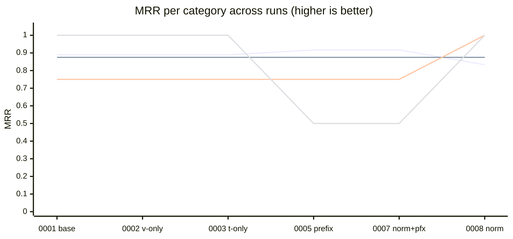

# Benchmark history

Append-only log of retrieval-quality experiments against the frozen query set
in `../queries.toml`. Each file is either a **run** (written by
`benchmarks/runner.py`) or a **findings** note (written by hand after a
direction has been decided — positive or negative). See `../README.md` for
the rules of the house.

## Index

| # | File | Kind | One-liner |
|---|---|---|---|
| 0001 | [baseline](0001-2026-04-19-baseline.md) | run | `memory_add_file`, no prefixes, `min_score=0`. Starting point for everything below. |
| 0002 | [weight-pure-semantic](0002-2026-04-19-weight-pure-semantic.md) | run | `vector_weight=1.0, text_weight=0.0`. Part of the weight sweep. |
| 0003 | [weight-pure-bm25](0003-2026-04-19-weight-pure-bm25.md) | run | `vector_weight=0.0, text_weight=1.0`. Part of the weight sweep. |
| 0004 | [findings-weight-tuning](0004-2026-04-19-findings-weight-tuning.md) | findings | Weights move top-1 *scores* but not ranks — dead end. Flagged the real levers: prefixes + text normalization. |
| 0005 | [passage-query-prefixes](0005-2026-04-19-passage-query-prefixes.md) | run | Added `passage:` at ingest + `query:` at lookup (e5-instruct protocol). |
| 0006 | [findings-passage-query-prefixes](0006-2026-04-19-findings-passage-query-prefixes.md) | findings | Modest +MRR on A; soft regression on Q18; Q14 unchanged, as predicted. |
| 0007 | [text-normalization](0007-2026-04-20-text-normalization.md) | run | NFKC + digit-space-digit collapse with the `query:` prefix still in place. Q14 **still miss** — diagnostic, kept on purpose. |
| 0008 | [text-normalization](0008-2026-04-20-text-normalization.md) | run | Same normalization, `query:` prefix removed. Cat C flips to 100%/100%/1.000; Q18 restored. |
| 0009 | [findings-text-normalization](0009-2026-04-20-findings-text-normalization.md) | findings | Why normalization alone wasn't enough: `query:` prefix AND-s an unindexed token through FTS5 and zeroes the BM25 channel. |

## Progression (MRR per category)



Lines (top-to-bottom order in which they start on the y-axis at run 0001):
**E** = 1.000 flat then dip at 0005/0007 then restore. **A** = 0.889 → 0.917
(prefix) → 0.833 (Q05 rank-1 → 2). **B** = 0.875 flat. **C** = 0.750 flat
through 0007, **1.000 at 0008** — the keystone move.

Category D is omitted — by construction it's a nonsense probe (`expected = []`),
so MRR is always 0.000 and carries no signal. Cat D is measured through
`avg top-1` and the `A – D` discrimination gap instead.

## Headline deltas (0001 → 0008)

| Cat | N | Hit@3 base → now | MRR base → now | Meaning |
|---|---|---|---|---|
| A natural | 6 | 100% = 100% | 0.889 → 0.833 | One soft regression (Q05 rank 1 → 2 inside top-3). |
| B multi-target | 4 | 100% = 100% | 0.875 = 0.875 | No movement. |
| **C exact-string** | 4 | **75% → 100%** | **0.750 → 1.000** | **The keystone.** Q14 miss → rank-1 @ 1.000. |
| D nonsense | 3 | — | — | Still filtered out; avg top-1 ~0.817, essentially unchanged. |
| **E `dach`** | 1 | 100% = 100% | 1.000 → 0.500 → **1.000** | Restored to baseline after the 0005 dip. |

**Discrimination gap A vs. D (avg top-1):** `+0.0901` (0001) →
`+0.1017` (0005) → `+0.0909` (0008) — effectively flat.

## What each experiment taught us

1. **Weights are not a calibration lever** (0004). `memory_search` surfaces
   the same chunks regardless of vector/text split on this corpus; raw scores
   shift, ranks don't.
2. **The e5-instruct prompt protocol helps — on the passage side only**
   (0006). Priming the embedding for passages gave modest A-MRR lift;
   mirroring with `query:` on the lookup side silently killed BM25 because
   `query` is not an indexed token (0009).
3. **Token alignment is the right abstraction for exact-string retrieval**
   (0009). NFKC + digit-space-digit collapse is ~20 lines of code and
   flips every exact-string probe to rank 1.

## Potential next levers

Not done here; listed so the next contributor can pick without re-diagnosing:

- **`min_score` calibration.** D avg top-1 ≈ 0.817, C avg top-1 ≈ 0.913 —
  a threshold near 0.85 would filter most nonsense without cutting valid
  hits. Post-filter only, no re-ingest.
- **Chunking.** Currently 256/50 tokens (`memory_add_text` hangs on 512/100
  for some Polish files). If the native chunker gets more robust, larger
  chunks may help B (multi-target) MRR.
- **Snippet / chunk-level BM25 re-ranking for Cat A ambiguity.** Q05's
  rank 1→2 regression is purely a lexical-overlap artefact that a light
  re-ranker could fix without touching retrieval.

## Running a new experiment

```bash
uv run python -m benchmarks.runner --label <short-slug>
```

The runner writes `NNNN-YYYY-MM-DD-<slug>.md` here automatically. If the
result is a dead end, follow it with a hand-written
`NNNN-YYYY-MM-DD-findings-<topic>.md` explaining *why*, so the path isn't
re-walked.
